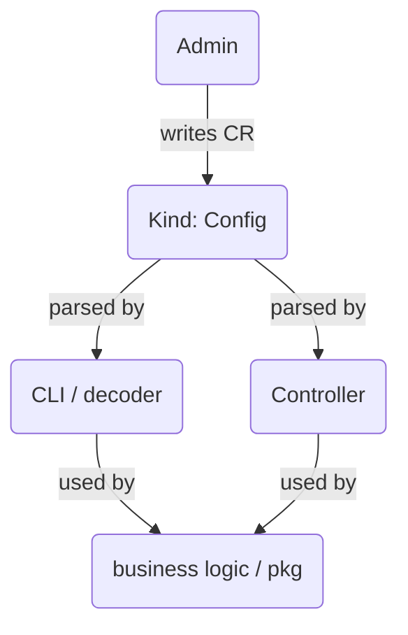

# Design document for the SWDT CLI. 

This document is a reference for decisions regarding multi-OS support architecture. It is developed with Cobra/spf13 to conform to a stable namespace and different connection libraries to support remote command execution.

Follow the [docs](../../docs) for more information.

## Subcommands and namespace

These are the current supported subcommands for the program:

* `swdt setup`
  * Initialize the node setup, enabling RDP, installing Choco and packages, etc.
* `swdt kubernetes`
  * Deploy Kubernetes binaries from the HTTP server indicated in the configuration.
* `swdt readiness`
  * Run the [windows operational readiness](https://github.com/kubernetes-sigs/windows-operational-readiness) project in the local cluster

## Configuration

The configuration API follows the GVK (GroupVersionKind) model from Kubernetes, using api-machinery for marshaling and unmarshalling, as well as defaulting values and validating its content. The goal of reusing this API is to enable sharing of the data structure not only with the CLI, but also with controllers and other projects in a well-known and agreed-upon format.

The project contains a Makefile with targets to generate the required API management and boilerplate functions



### Fields and schema

These are the supported fields for configuring access node credentials, setting up options, and providing Kubernetes binaries information. 

* Credentials: support for SSH and WinRM settings
* Setup: Define options for initial node bootstrap
* Kubernetes: Auxiliary Kubernetes binaries installation

Following a configuration sample:

```
apiVersion: windows.k8s.io/v1alpha1
kind: Config
metadata:
  name: sample
spec:
  credentials:
    username: Administrator
    hostname: 192.168.122.220:22
    publicKey:
  setup:
    enableRDP: true
    chocoPackages:
      - vim
      - grep
  kubernetes:
    deploys:
      - name: containerd:
        version: 1.7.11
        sourceURL: http://xyz/containerd.exe
        destination: c:\Program Files\containerd\bin\containerd.exe
        overwrite: true
      - name: kubelet
        version: 1.29.0
        sourceURL: http://xyz/kubelet.exe
        destination: c:\k\kubelet.exe
        overwrite: true
```

## Connections

Currently, the project SSH for running commands remotely on the node. The common fields required are username and hostname. To proceed, ssh object content should be filled out with the proper connections parameters.